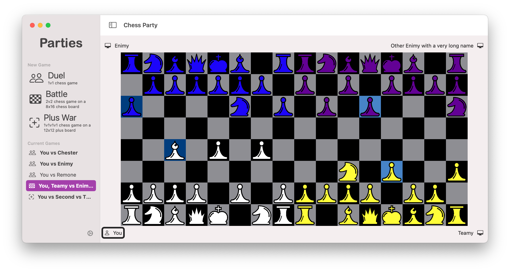

# Robert Swanson Portfolio

This document serves as the collection point for all my Computer Science work.

## [School Portfolio](https://github.com/robert-swanson/taylor-portfolio) 

This repo is a copy of the full repository located [here](https://bitbucket.org/rswanson3141/privateportfolio/src/master/), which is a private repository on Bitbucket because it contains answers to homework assignments for many classes and my professors preferred I didn't publicly share them. **To receive access to the full repo, email me at `robert_swanson@taylor.edu` and I will add you as a read-only collaborator.** You must have a BitBucket account  for me to do this.

## [Research: College Course Scheduling](https://github.com/robert-swanson/taylor-portfolio/tree/master/cos452%263-research)

Project for “Research 1” & “Research 2” (spring & fall 2021) looking into the college course scheduling problem. Read the [literature survey](https://github.com/robert-swanson/taylor-portfolio/blob/master/cos452%263-research/documents/Survey_on_College_Course_Scheduling_Algorithms.pdf) and spring semester [state of research paper](https://github.com/robert-swanson/taylor-portfolio/blob/master/cos452%263-research/documents/Research_I_Archive_Paper-2.pdf), and look at the [DSL and evaluator prototype](https://github.com/robert-swanson/Preference-Specification-Language/tree/d3a2c2aeca26a83824b34038adfa88acdb3a7912) produced in the spring. This project involves looking into how students can express (in a generic way) their requirements and preferences for their “four” year plan. Beyond that, it hopes to look into automatically generating 4 year plans that optimize according to those preferences.

## [ChessParty IOS App](https://github.com/vermillingua/Chess-Party)

This is an ongoing collaboration with [Daniël du Preez](https://github.com/AfricanRunner)  started in January 2021 to develop an IOS chess app that can facilitate variants of chess involving differing numbers of players (for example 2v2 team play). The project utilizes the SwiftUI framework and supports iOS, iPadOS, and MacOS. I have developed the application Views and ViewModels, and done some work on the Models, and will look into adding Game Center multiplayer functionality.  Daniël has focused on the chess logic models and is currently looking into supporting the UCI protocol to support external chess engines. 

## [JavaFX Chess](https://github.com/robert-swanson/Chess)

This was a personal project of mine during the summer of 2017. It offers a fully functional chess user interface as well as a customizable chess engine. The interface offered piece animations, board editing (totally not for cheating with a real game of chess), and helpful graphical indicators. The engine implemented the minimax algorithm, which could be customized from a GUI interface to implement alpha-beta pruning, iterative deepening, a killer heuristic, and transposition tables.

*Disclaimer: I wrote this code in high school and it follows no semblance of good coding practice, please look at more recent projects to get a feel for my current coding style.*

## [Java Neural Network](https://github.com/robert-swanson/JavaNeuralNetworkLibrary)

This was a personal project of mine during the summer of 2018. Using only a [YouTube series](https://www.youtube.com/watch?v=aircAruvnKk&list=PLZHQObOWTQDNU6R1_67000Dx_ZCJB-3pi) explaining the math of neural networks, I implemented a neural network library from scratch. It featured customizable network structures, classification using forward propagation, and training using back propagation.

I tested and applied this neural network to the image classification of digits from the [MNIST](http://yann.lecun.com/exdb/mnist/) dataset. After training I was able to achieve slightly over 90% accuracy.

*Disclaimer: Again, I wrote this code in high school and, though it is a little better than JavaFX chess, it is still poorly written code, please look at more recent projects to get a feel for my current coding style.*

## [Neural Network Chess](https://github.com/robert-swanson/NeuralNetworkChess)

This was an attempt to take the JavaFX project, and implement a chess engine that could utilize the Java Neural Network project. I did this on my own as a project for my "Intro to AI" class in 2020. The engine was implemented to still utilize the minimax algorithm, but change the scoring mechanism from one that simply sums point values of pieces to one that feeds the board state to a NN model that can produce a score for that board state. Ultimately, in the time I had, I was not able to see a competent player arise from my training sessions, for future work I'd like to more carefully analyze my training and scoring processes.

*Disclaimer: just combine the two preceding disclaimers*

## [Raspberry Pi Robot](https://github.com/robert-swanson/PiBot)

This was a personal project of mine that I worked on in 2018 that involved creating a robot from 3D printed parts, which was controlled by a Raspberry Pi Zero W. I created an [instructable](https://www.instructables.com/id/3D-Printed-Raspberry-Pi-Zero-Robot/) that describes the creation process and the operation of the robot.

The frame was designed in blender, the robot-side code used *python* and was controlled by an iOS app (written in *Swift*) that served as the remote controller. This app connected to the raspberry pi via a socket to send instructions. It also connected to a service running on the pi that streamed a video signal from the mounted camera. The app could control movement with either a GUI joystick, or with accelerometers.

## [Rideshare Multi-tier Web App](https://github.com/robert-swanson/RideSharePlatform)
*By request of my professor, this repo will be private until the end of the semester*

This was a group project for Multi-Tiered Web Design that implemented a model view controller architecture. It was intended to serve as a platform to connect driving students with those who need a ride home.

It used a PostgreSQL database which interfaced with a hapi server using objection and knex. The front end was implemented in Vue and Vuetify.

## [Python Grader](https://repo.cse.taylor.edu/dfletche/python-grader)

This was a project belonging to a couple of upperclassmen that I joined for a few weeks during the sumer of 2019. It followed a similar architecture as my ride share project did. I implemented several back-end security features as well as several user interface features.

## [Health Data Analysis](https://github.com/robert-swanson/HealthData)
This was a project I did for Intro to Data science. I took data collected from my Apple Watch over the last few years, exported it, and parsed it with this R script, which then analyzed for correlation between different health characteristics, particularly those relating to quality and quantity of sleep.

## [CLI Time Tracking Service](https://github.com/robert-swanson/TimeTrackingService)

This was a *bash* project I did in 2019 for one of my classes, but was also a tool I used myself to track my time. 

This is a tool to track time usage by starting, ending, and labeling timers. It is designed to be used with Alfred and can provide suggestions formatted as JSON.

## [Address Book IOS App](https://github.com/robert-swanson/AddressBookApp)

This was a *Swift* project I did in 2019 for one of my classes that implemented a *SQLite* database and basic GUI to offer basic contacts tracking functionality.

## [Monopoly Currency Tracking IOS App](https://github.com/robert-swanson/MonopolyPal)

 This was a personal project I did way back in 2016 when I was first learning *Swift* and iOS development in Xcode. It was intended to be used as replacement for the bank when playing the board game *Monopoly*. It offered a GUI that allowed users to perform actions (eg Pass Go) and it would both show each players balance, and track the history of the game.